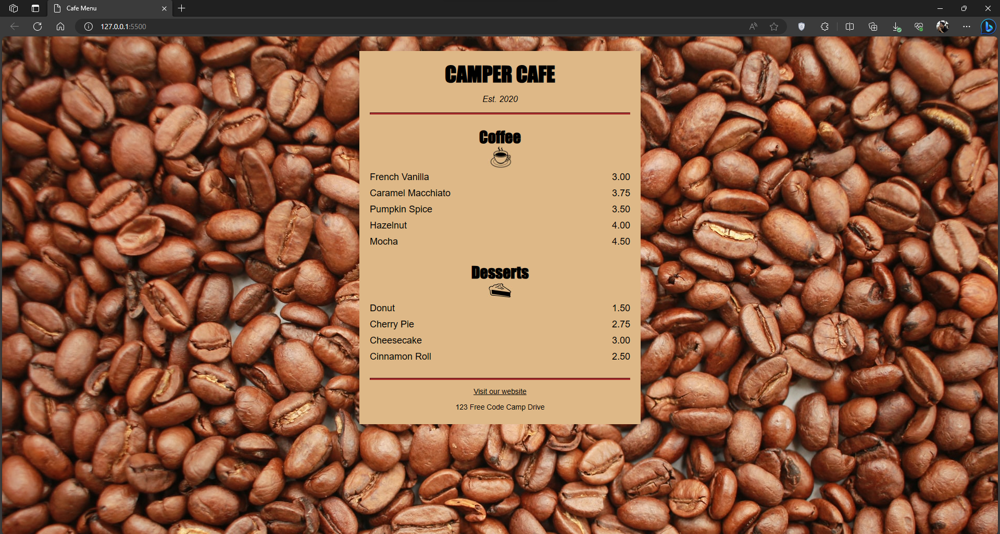
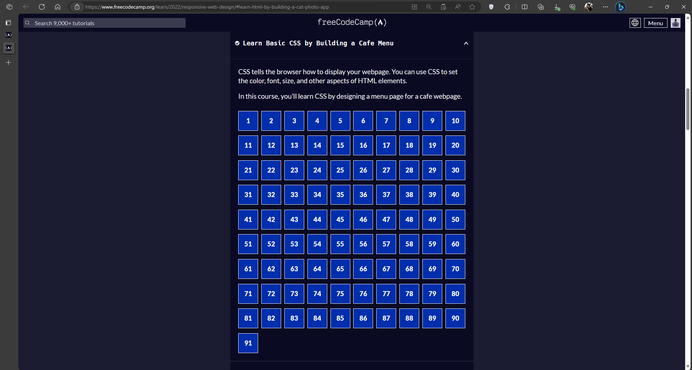

# Cafe Menu
The purpose of this repo is to monitor my progress in learning HTML and CSS by making a basic CafeMenu. I am utilizing the freeCodeCamp [Learn Basic CSS by Building a Cafe Menu](https://www.freecodecamp.org/learn/2022/responsive-web-design/#learn-basic-css-by-building-a-cafe-menu) for this repo.

## Screenshots

## Learnings
1. Learned the concept of CSS variables and how to use them.
2. I've realized that I need to learn more about CSS positioning and how to use it properly.
3. Addings elements and designing them.
4. Psuedo-classes and how to use them.